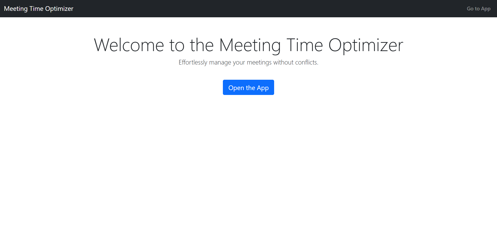
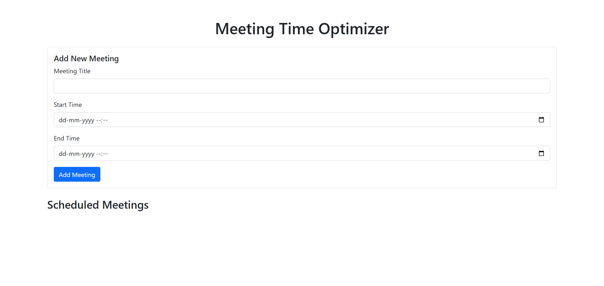
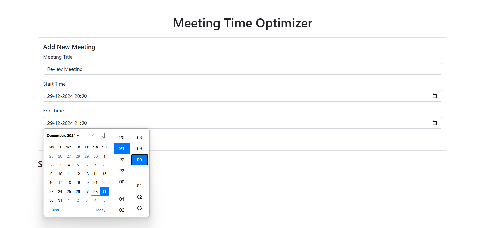
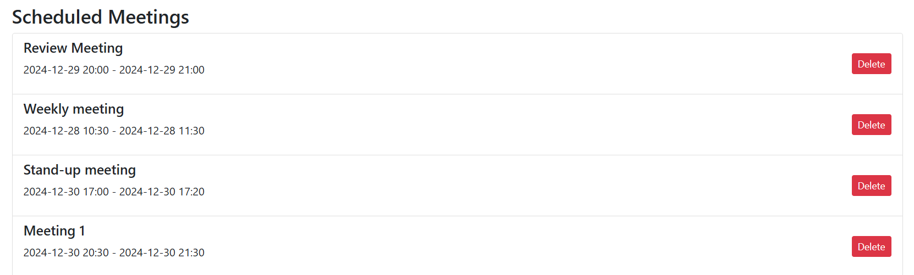
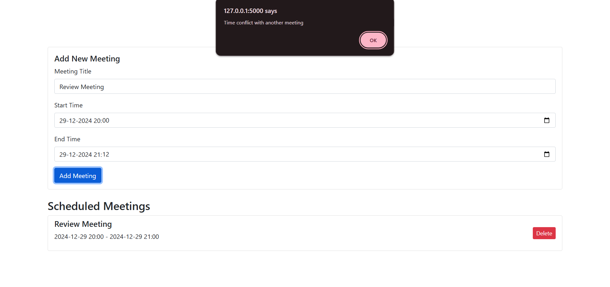

# **Meeting Time Optimizer**
## **Project Description**
Meeting Time Optimizer is a web-based application designed to help users schedule meetings efficiently. It ensures no time conflicts between meetings and provides an easy-to-use interface for adding, viewing, and deleting scheduled meetings.

## **Setup Instructions**

  **1. Clone the Repository:**
  ```
  git clone https://github.com/sakshi-is-committed/meeting-time-optimizer.git
  cd meeting-time-optimizer
  ```

  **2. Install Dependencies:** Ensure you have Python installed. Then, install the required dependencies:
  ```
  pip install flask
  ```
  **3. Run the Application:**
  ```
  python app.py
  ```
  **4. Access the App:** Open your browser and navigate to 
  ```
  http://127.0.0.1:5000.
  ```

## **Features Overview**

  - **Add Meetings:**

    - Specify a title, start time, and end time.
    - Automatically checks for time conflicts.

  - **View Meetings:**

    - Displays a list of all scheduled meetings with their details.

  - **Delete Meetings:**

    - Remove any meeting with a single click.

## **Screenshots**

### **Home Page**



### **Add Meeting Form**




### **View Meetings**


### **Conflict Alert**

